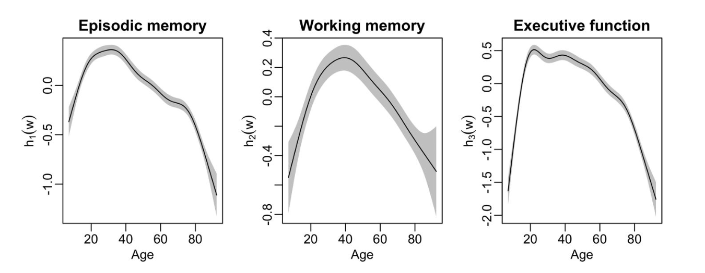

---

##### Download

+ [Paper](https://doi.org/10.1080/00273171.2024.2385336)

---

##### Abstract

We present the R package galamm, whose goal is to provide common ground between structural equation modeling and mixed effect models. It supports estimation of models with an arbitrary number of crossed or nested random effects, smoothing splines, mixed response types, factor structures, heteroscedastic residuals, and data missing at random. Implementation using sparse matrix methods and automatic differentiation ensures computational efficiency. We here briefly present the implemented methodology, give an overview of the package and an example demonstrating its use.

---

##### Figure 1



---

##### Citation

Sørensen, Ø. (2024). Multilevel Semiparametric Latent Variable Modeling in R with “galamm.” Multivariate Behavioral Research, 59(5), 1098–1105. https://doi.org/10.1080/00273171.2024.2385336


```BibTeX
@article{sorensenMultilevelSemiparametricLatent2024,
  title = {Multilevel {{Semiparametric Latent Variable Modeling}} in {{R}} with ``Galamm''},
  author = {S{\o}rensen, {\O}ystein},
  year = {2024},
  month = sep,
  journal = {Multivariate Behavioral Research},
  volume = {59},
  number = {5},
  pages = {1098--1105},
  publisher = {Routledge},
  issn = {0027-3171},
  doi = {10.1080/00273171.2024.2385336},
  pmid = {39141406},
  keywords = {Generalized additive models,item response theory,mixed models,mixed response,R,structural equation modeling}
}
```

---

##### Related material

+ [R package implementing the methods](https://cran.r-project.org/package=galamm)
