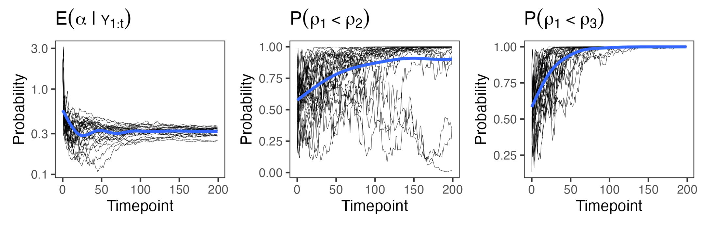

---

##### Download

+ [Paper](https://doi.org/10.1214/25-BA1564)

---

##### Abstract

The Bayesian Mallows model is a flexible tool for analyzing data in the form of complete or partial rankings, and transitive or intransitive pairwise preferences. In many potential applications of preference learning, data arrive sequentially and it is of practical interest to update posterior beliefs and predictions efficiently, based on the currently available data. Despite this, most algorithms proposed so far have focused on batch inference. In this paper we present an algorithm for sequentially estimating the posterior distributions of the Bayesian Mallows model using nested sequential Monte Carlo. The algorithm requires minimal user input in the form of tuning parameters, is straightforward to parallelize, and returns the marginal likelihood as a direct byproduct of estimation. We evaluate its performance in simulation experiments, and illustrate a real use case with sequential ranking of Formula 1 drivers throughout three seasons of races.

---

##### Figure 5



---

##### Citation

Sørensen, Ø., Stein, A., Netto, W. L., & Leslie, D. S. (2025). Sequential Rank and Preference Learning with the Bayesian Mallows Model. Bayesian Analysis, 1(1), 1–26. https://doi.org/10.1214/25-BA1564


```BibTeX
@article{Sorensen2025,
  title = {Sequential Rank and Preference Learning with the Bayesian Mallows Model},
  volume = {1},
  ISSN = {1936-0975},
  url = {http://dx.doi.org/10.1214/25-BA1564},
  DOI = {10.1214/25-ba1564},
  number = {1},
  journal = {Bayesian Analysis},
  publisher = {Institute of Mathematical Statistics},
  author = {Sørensen,  Øystein and Stein,  Anja and Netto,  Waldir Leoncio and Leslie,  David S.},
  year = {2025},
  month = jan 
}
```

---

##### Related material

+ [R package implementing the methods](https://github.com/osorensen/BayesMallowsSMC2)
