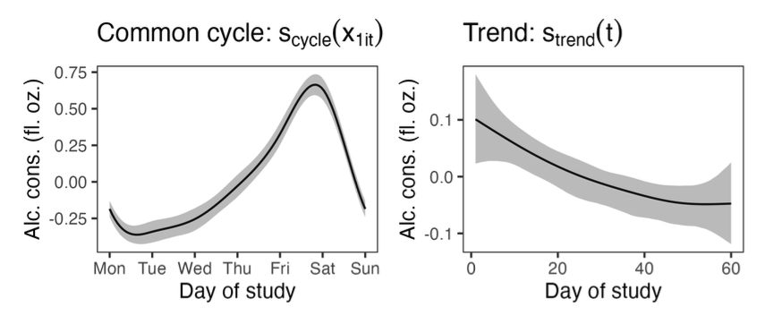

---

##### Download

+ [Paper](https://doi.org/10.31234/osf.io/2ajpt)
+ [Stan code](https://osf.io/qpkmg/)

---

##### Abstract

Intensive longitudinal data with a large number of timepoints per individual are becoming increasingly common. Such data allow going beyond the classical growth model situation and studying population effects and individual variability not only in trends over time but also in autoregressive effects, cross-lagged effects, and the noise term. Dynamic structural equation models (DSEMs) have become very popular for analyzing intensive longitudinal data. However, when the data contain trends, cycles, or time-varying predictors which have nonlinear effects on the outcome, DSEMs require the practitioner to specify the correct parametric form of the effects, which may be challenging in practice. In this paper we show how to alleviate this issue by introducing regression splines which are able to flexibly learn the underlying function shapes. Our main contribution is thus a building block to the DSEM modeler's toolkit, and we discuss smoothing priors and hierarchical smooth terms using the special cases of two-level lag-1 autoregressive and vector autoregressive models as examples. We illustrate in simulation studies how ignoring nonlinear trends may lead to biased parameter estimates, and then show how to use the proposed framework to model weekly cycles and long-term trends in diary data on alcohol consumption and perceived stress.

---

##### Figure 4



---

##### Citation

Sørensen, Ø., & McCormick, E. M. (2025). Modeling Cycles, Trends and Time-Varying Effects in Dynamic Structural Equation Models with Regression Splines. OSF. https://doi.org/10.31234/osf.io/2ajpt


```BibTeX
@misc{sorensenModelingCyclesTrends2025,
  title = {Modeling {{Cycles}}, {{Trends}} and {{Time-Varying Effects}} in {{Dynamic Structural Equation Models}} with {{Regression Splines}}},
  author = {S{\o}rensen, {\O}ystein and McCormick, Ethan M.},
  year = {2025},
  month = jan,
  publisher = {OSF},
  doi = {10.31234/osf.io/2ajpt},
  archiveprefix = {OSF},
  langid = {american},
  keywords = {DSEM,intensive longitudinal data,regression splines,smoothing,Stan.}
}
```

