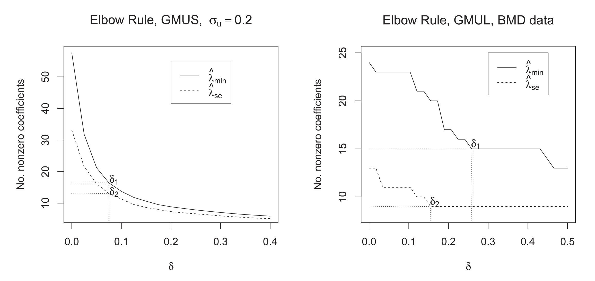

---

##### Download

+ [Paper](https://doi.org/10.1080/10618600.2018.1425626)

---

##### Abstract

In many problems involving generalized linear models, the covariates are subject to measurement error. When the number of covariates $p$ exceeds the sample size $n$, regularized methods like the lasso or Dantzig selector are required. Several recent papers have studied methods which correct for measurement error in the lasso or Dantzig selector for linear models in the $p > n$ setting. We study a correction for generalized linear models, based on Rosenbaum and Tsybakov’s matrix uncertainty selector. By not requiring an estimate of the measurement error covariance matrix, this generalized matrix uncertainty selector has a great practical advantage in problems involving high-dimensional data. We further derive an alternative method based on the lasso, and develop efficient algorithms for both methods. In our simulation studies of logistic and Poisson regression with measurement error, the proposed methods outperform the standard lasso and Dantzig selector with respect to covariate selection, by reducing the number of false positives considerably. We also consider classification of patients on the basis of gene expression data with noisy measurements. Supplementary materials for this article are available online.

---

##### Figure 2

Left: elbow rule with logistic regression. The average number of nonzero coefficients is plotted against δ. Right: elbow rule for the BMD example.



---

##### Citation

Sørensen, Ø., Hellton, K. H., Frigessi, A., & Thoresen, M. (2018). Covariate Selection in High-Dimensional Generalized Linear Models With Measurement Error. Journal of Computational and Graphical Statistics, 27(4), 739–749. https://doi.org/10.1080/10618600.2018.1425626


```BibTeX
@article{Srensen2018,
  title = {Covariate Selection in High-Dimensional Generalized Linear Models With Measurement Error},
  volume = {27},
  ISSN = {1537-2715},
  url = {http://dx.doi.org/10.1080/10618600.2018.1425626},
  DOI = {10.1080/10618600.2018.1425626},
  number = {4},
  journal = {Journal of Computational and Graphical Statistics},
  publisher = {Informa UK Limited},
  author = {Sørensen,  Øystein and Hellton,  Kristoffer Herland and Frigessi,  Arnoldo and Thoresen,  Magne},
  year = {2018},
  month = jun,
  pages = {739–749}
}
```

---

##### Related material

+ [R package implementing the methods](https://cran.r-project.org/package=hdme)
