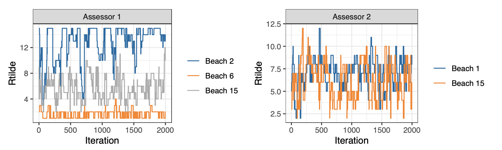

---

##### Download

+ [Paper](https://journal.r-project.org/archive/2020/RJ-2020-026/index.html)

---

##### Abstract

BayesMallows is an R package for analyzing preference data in the form of rankings with the Mallows rank model, and its finite mixture extension, in a Bayesian framework. The model is grounded on the idea that the probability density of an observed ranking decreases exponentially with the distance to the location parameter. It is the first Bayesian implementation that allows wide choices of distances, and it works well with a large amount of items to be ranked. BayesMallows handles non-standard data: partial rankings and pairwise comparisons, even in cases including non-transitive preference patterns. The Bayesian paradigm allows coherent quantification of posterior uncertainties of estimates of any quantity of interest. These posteriors are fully available to the user, and the package comes with convienient tools for summarizing and visualizing the posterior distributions.

---

##### Figure 5



---

##### Citation

Øystein Sørensen, Marta Crispino, Qinghua Liu and Valeria Vitelli , The R Journal (2020) 12:1, pages 324-342.


```BibTeX
@article{RJ-2020-026,
  author = {Øystein Sørensen and Marta Crispino and Qinghua Liu and
          Valeria Vitelli},
  title = {{BayesMallows: An R Package for the Bayesian Mallows Model}},
  year = {2020},
  journal = {{The R Journal}},
  doi = {10.32614/RJ-2020-026},
  url = {https://doi.org/10.32614/RJ-2020-026},
  pages = {324--342},
  volume = {12},
  number = {1}
}
```

---

##### Related material

+ [R package BayesMallows](https://cran.r-project.org/package=BayesMallows)
