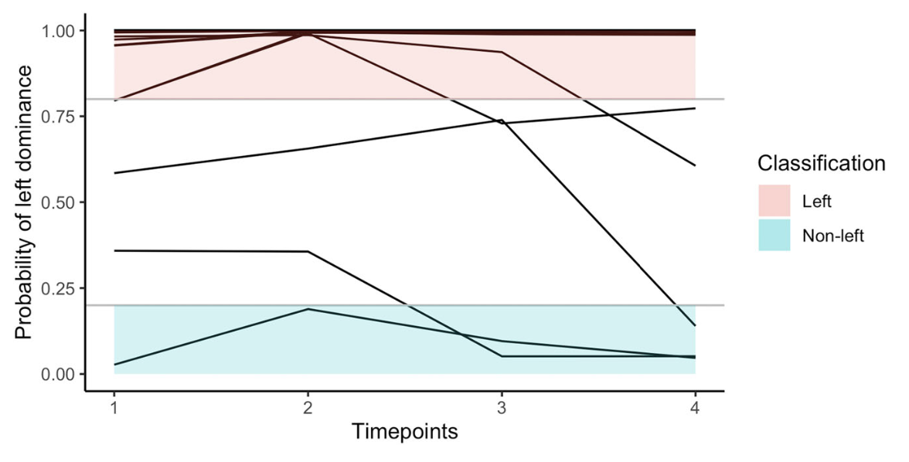

---

##### Download

+ [Paper](https://doi.org/10.1080/1357650X.2020.1769124)
+ [OSF repository with analysis code](https://osf.io/mkwcr)

---

##### Abstract

Researchers interested in hemispheric dominance frequently aim to infer latent functional differences between the hemispheres from observed lateral behavioural or brain-activation differences. To be valid, these inferences may not only rely on the observed laterality measures but also need to account for the antecedent probabilities of the studied latent classes. This fact is frequently ignored in the literature, leading to misclassifications especially when considering low probability classes as, for example, “atypical” right hemispheric language dominance. In the present paper, we revisit this inference problem (a) by outlining a general Bayesian framework for the inferential process and (b) by exemplarily applying this framework on the inference of hemispheric dominance for speech processing from dichotic-listening laterality scores. Utilizing large-scale empirical data sets as well as simulation studies, we show that valid inferences also regarding low probable latent classes can be drawn applying the present framework, although within certain boundaries. We further illustrate that repeated laterality measures of the same person may be used to improve the classification outcome. The article additionally provides R package and Shiny app implementations of the suggested Bayesian framework, which allow to explore the boundaries of valid inference for the present and other examples.

---

##### Figure 4



---

##### Citation

Sørensen, Ø., & Westerhausen, R. (2020). From observed laterality to latent hemispheric differences: Revisiting the inference problem. Laterality, 25(5), 560–582. https://doi.org/10.1080/1357650X.2020.1769124


```BibTeX
@article{sorensenObservedLateralityLatent2020,
  title = {From Observed Laterality to Latent Hemispheric Differences: {{Revisiting}} the Inference Problem},
  shorttitle = {From Observed Laterality to Latent Hemispheric Differences},
  author = {S{\o}rensen, {\O}ystein and Westerhausen, Rene},
  year = {2020},
  month = sep,
  journal = {Laterality},
  volume = {25},
  number = {5},
  pages = {560--582},
  publisher = {Routledge},
  issn = {1357-650X},
  doi = {10.1080/1357650X.2020.1769124},
  pmid = {32456592},
  keywords = {Bayesian classification,brain asymmetry,handedness,hemispheric differences,laterality}
}
```

---

##### Related material

+ [R package implementing the methods](https://cran.r-project.org/package=BayesianLaterality)
+ [Shiny app](https://osorensen.shinyapps.io/BayesianLateralityApp/)
