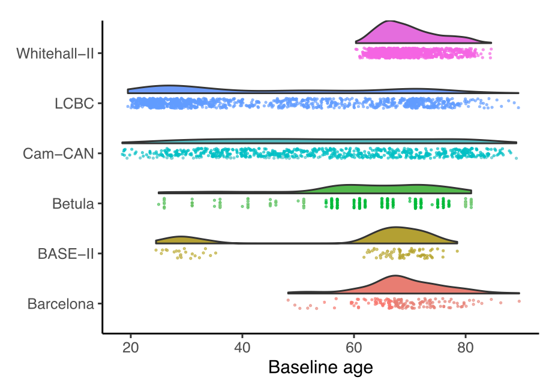

---

##### Download

+ [Paper](https://www.doi.org/10.1016/j.neuroimage.2020.117416)

---

##### Abstract

Analyzing data from multiple neuroimaging studies has great potential in terms of increasing statistical power, enabling detection of effects of smaller magnitude than would be possible when analyzing each study separately and also allowing to systematically investigate between-study differences. Restrictions due to privacy or proprietary data as well as more practical concerns can make it hard to share neuroimaging datasets, such that analyzing all data in a common location might be impractical or impossible. Meta-analytic methods provide a way to overcome this issue, by combining aggregated quantities like model parameters or risk ratios. Most meta-analytic tools focus on parametric statistical models, and methods for meta-analyzing semi-parametric models like generalized additive models have not been well developed. Parametric models are often not appropriate in neuroimaging, where for instance age-brain relationships may take forms that are difficult to accurately describe using such models. In this paper we introduce meta-GAM, a method for meta-analysis of generalized additive models which does not require individual participant data, and hence is suitable for increasing statistical power while upholding privacy and other regulatory concerns. We extend previous works by enabling the analysis of multiple model terms as well as multivariate smooth functions. In addition, we show how meta-analytic p-values can be computed for smooth terms. The proposed methods are shown to perform well in simulation experiments, and are demonstrated in a real data analysis on hippocampal volume and self-reported sleep quality data from the Lifebrain consortium. We argue that application of meta-GAM is especially beneficial in lifespan neuroscience and imaging genetics. The methods are implemented in an accompanying R package metagam, which is also demonstrated.

---

##### Figure 6



---

##### Citation

Sørensen, Ø., Brandmaier, A. M., Macià, D., Ebmeier, K., Ghisletta, P., Kievit, R. A., Mowinckel, A. M., Walhovd, K. B., Westerhausen, R., & Fjell, A. (2021). Meta-analysis of generalized additive models in neuroimaging studies. NeuroImage, 224, 117416. https://doi.org/10.1016/j.neuroimage.2020.117416


```BibTeX
@article{sorensenMetaanalysisGeneralizedAdditive2021,
  title = {Meta-Analysis of Generalized Additive Models in Neuroimaging Studies},
  author = {S{\o}rensen, {\O}ystein and Brandmaier, Andreas M. and Maci{\`a}, D{\'i}dac and Ebmeier, Klaus and Ghisletta, Paolo and Kievit, Rogier A. and Mowinckel, Athanasia M. and Walhovd, Kristine B. and Westerhausen, Rene and Fjell, Anders},
  year = {2021},
  month = jan,
  journal = {NeuroImage},
  volume = {224},
  pages = {117416},
  issn = {1053-8119},
  doi = {10.1016/j.neuroimage.2020.117416},
  langid = {english},
  keywords = {Data protection,Distributed learning,Generalized additive mixed models,Generalized additive models,Meta-analysis,Privacy}
}
```

---

##### Related material

+ [R package implementing the methods](https://cran.r-project.org/package=metagam)
