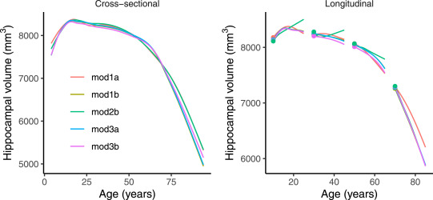

---

##### Download

+ [Paper](https://www.doi.org/10.1016/j.neuroimage.2020.117596)
+ [OSF repository with analysis code](https://osf.io/xnuhz/)

---

##### Abstract

We address the problem of estimating how different parts of the brain develop and change throughout the lifespan, and how these trajectories are affected by genetic and environmental factors. Estimation of these lifespan trajectories is statistically challenging, since their shapes are typically highly nonlinear, and although true change can only be quantified by longitudinal examinations, as follow-up intervals in neuroimaging studies typically cover less than 10% of the lifespan, use of cross-sectional information is necessary. Linear mixed models (LMMs) and structural equation models (SEMs) commonly used in longitudinal analysis rely on assumptions which are typically not met with lifespan data, in particular when the data consist of observations combined from multiple studies. While LMMs require a priori specification of a polynomial functional form, SEMs do not easily handle data with unstructured time intervals between measurements. Generalized additive mixed models (GAMMs) offer an attractive alternative, and in this paper we propose various ways of formulating GAMMs for estimation of lifespan trajectories of 12 brain regions, using a large longitudinal dataset and realistic simulation experiments. We show that GAMMs are able to more accurately fit lifespan trajectories, distinguish longitudinal and cross-sectional effects, and estimate effects of genetic and environmental exposures. Finally, we discuss and contrast questions related to lifespan research which strictly require repeated measures data and questions which can be answered with a single measurement per participant, and in the latter case, which simplifying assumptions that need to be made. The examples are accompanied with R code, providing a tutorial for researchers interested in using GAMMs.

---

##### Figure 12



---

##### Citation

Sørensen, Ø., Walhovd, K. B., & Fjell, A. M. (2021). A recipe for accurate estimation of lifespan brain trajectories, distinguishing longitudinal and cohort effects. NeuroImage, 226, 117596. https://doi.org/10.1016/j.neuroimage.2020.117596


```BibTeX
@article{sorensenRecipeAccurateEstimation2021,
  title = {A Recipe for Accurate Estimation of Lifespan Brain Trajectories, Distinguishing Longitudinal and Cohort Effects},
  author = {S{\o}rensen, {\O}ystein and Walhovd, Kristine B. and Fjell, Anders M.},
  year = {2021},
  month = feb,
  journal = {NeuroImage},
  volume = {226},
  pages = {117596},
  issn = {1053-8119},
  doi = {10.1016/j.neuroimage.2020.117596},
  langid = {english},
  keywords = {Aging,Cohort effects,Generalized additive mixed models,Lifespan brain research,Longitudinal analysis,MRI,R}
}
```


