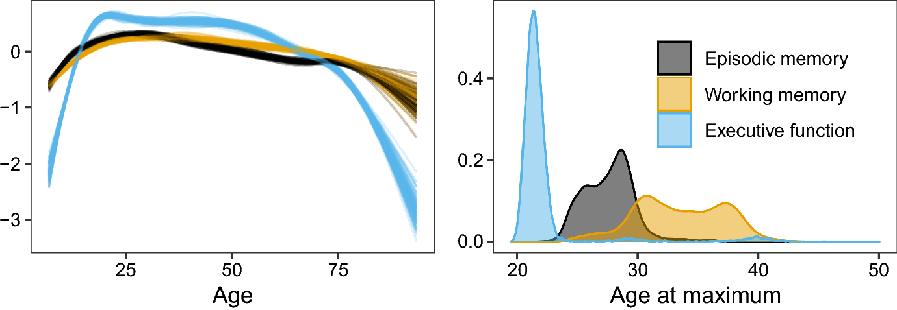

---

##### Download

+ [Paper](https://doi.org/10.1007/s11336-023-09910-z)

---

##### Abstract

We present generalized additive latent and mixed models (GALAMMs) for analysis of clustered data with responses and latent variables depending smoothly on observed variables. A scalable maximum likelihood estimation algorithm is proposed, utilizing the Laplace approximation, sparse matrix computation, and automatic differentiation. Mixed response types, heteroscedasticity, and crossed random effects are naturally incorporated into the framework. The models developed were motivated by applications in cognitive neuroscience, and two case studies are presented. First, we show how GALAMMs can jointly model the complex lifespan trajectories of episodic memory, working memory, and speed/executive function, measured by the California Verbal Learning Test (CVLT), digit span tests, and Stroop tests, respectively. Next, we study the effect of socioeconomic status on brain structure, using data on education and income together with hippocampal volumes estimated by magnetic resonance imaging. By combining semiparametric estimation with latent variable modeling, GALAMMs allow a more realistic representation of how brain and cognition vary across the lifespan, while simultaneously estimating latent traits from measured items. Simulation experiments suggest that model estimates are accurate even with moderate sample sizes.

---

##### Figure 3



---

##### Citation

Sørensen, Ø., Fjell, A. M., & Walhovd, K. B. (2023). Longitudinal Modeling of Age-Dependent Latent Traits with Generalized Additive Latent and Mixed Models. Psychometrika, 88(2), 456–486. https://doi.org/10.1007/s11336-023-09910-z


```BibTeX
@article{sorensenLongitudinalModelingAgeDependent2023,
  title = {Longitudinal {{Modeling}} of {{Age-Dependent Latent Traits}} with {{Generalized Additive Latent}} and {{Mixed Models}}},
  author = {S{\o}rensen, {\O}ystein and Fjell, Anders M. and Walhovd, Kristine B.},
  year = {2023},
  month = jun,
  journal = {Psychometrika},
  volume = {88},
  number = {2},
  pages = {456--486},
  issn = {1860-0980},
  doi = {10.1007/s11336-023-09910-z},
  langid = {english},
  keywords = {brain and cognition,generalized additive mixed models,latent variable modeling,lifespan trajectories,mixed response}
}
```

---

##### Related material

+ [R package implementing the methods](https://cran.r-project.org/package=galamm)
